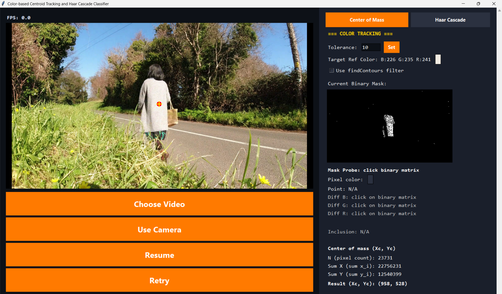
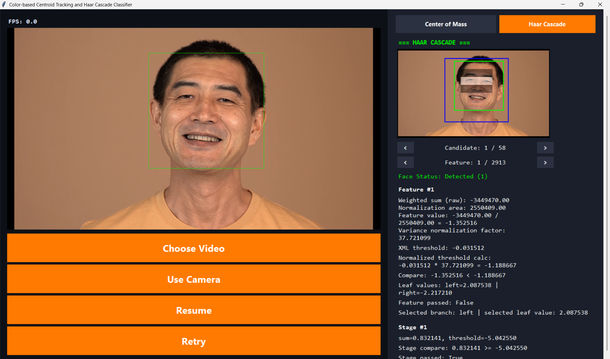
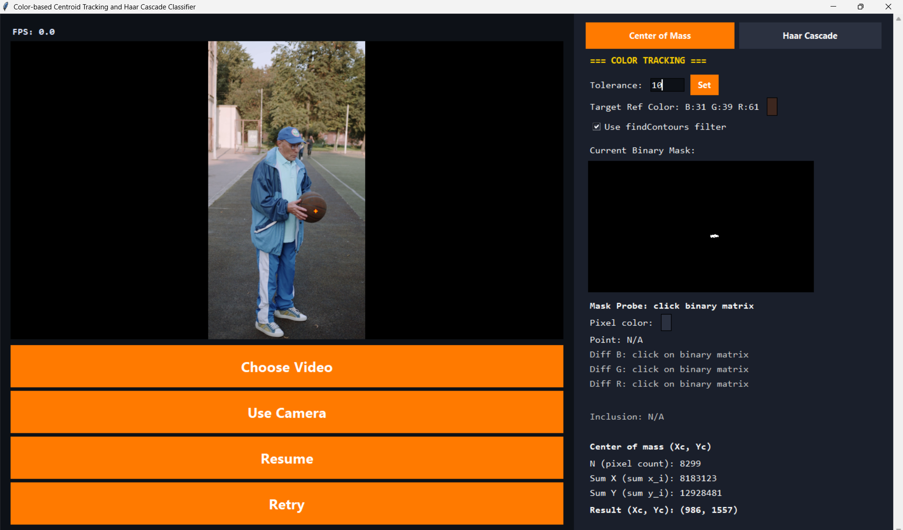

# Color-based Object Tracking using Center of Mass and Haar Cascade Classifier

This project demonstrates two computer vision techniques for object tracking and detection in video streams:

- Color-based Centroid Tracking: identifies and tracks a target object by its color and computes the center of mass of the selected region.
- Haar Cascade Classifier: detects faces in the video frame using OpenCV's Haar cascade classifier and visualizes the analysis details.

The application combines both approaches in a single interactive interface so users can compare the behavior of color-based tracking and Haar cascade-based face detection on the same video source.

## Project Overview

The application allows you to:

- choose a video file or use a camera stream,
- set a target color and tolerance,
- inspect the binary mask and centroid calculations,
- analyze face detection results,
- explore Haar feature evaluation and stage thresholds.

## Screenshots

### Color-based Centroid Tracking 1



### Haar Cascade Classifier 1



### Color-based Centroid Tracking 2



Sample videos for testing are available in the `video-samples` folder.

## Installation

Clone the repository:

```bash
git clone https://github.com/Nikita-Titarenko/color-based-object-tracking-using-center-of-mass
```

Change to the project directory:

```bash
cd color-based-object-tracking-using-center-of-mass
```

Install the dependencies:

```bash
pip install -r requirements.txt
```

Run the application (Python >= 3.14 required):

```bash
python main.py
```

## Notes

This project is intended for educational and experimental computer vision workflows. It is useful for understanding how centroid-based segmentation and Haar feature-based detection operate in practice.
